# T2A1 - Workbook - RfQ Response

## Name: Georgia Leng

> *ACME* Corporation is looking for *devs* with an understanding of *Rails*. The following set of questions relate to this RfQ-requirement. ( Word Count: 200-300 )

### Q1

------

**Question:** Describe the architecture of a typical *Rails* application ( 200-300 words )

**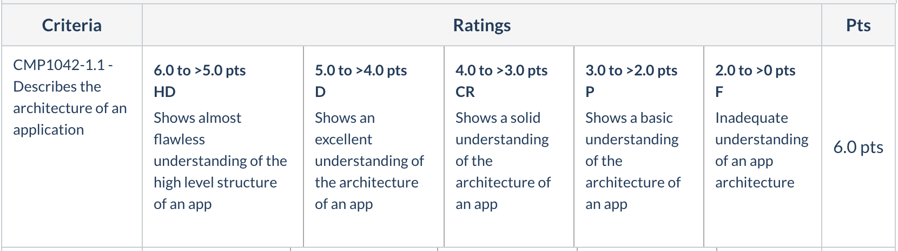**

 

### Q2

------

**Question:** **Identify** a database management system (DBMS) commonly used in web applications (including *Rails*) and discuss the pros and cons of this database. ( Word Count: 150-250 )

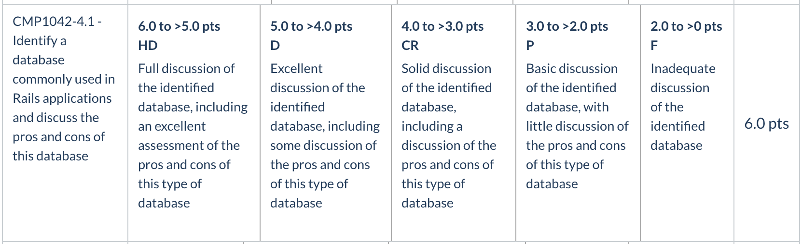

------

**PostgreSQL**

- PostgreSQL is one of the oldest yet the most advanced open source database management system.
- https://www.aalpha.net/blog/pros-and-cons-of-using-postgresql-for-application-development/

> ACME* Corporation is very big on project management, documentation and process. This will be a key metric in their decision to award the project. The following set of questions relate to this RfQ-requirement.

### Q3

------

**Discuss** the implementation of *Agile* project management methodology. ( Word Count: 200-300 )

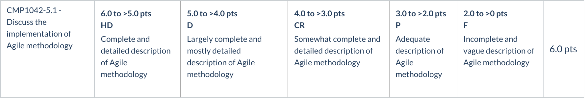

------

### Q4

------

Provide an **overview** and **description** of a standard source control workflow. ( Word Count: 100-200 )

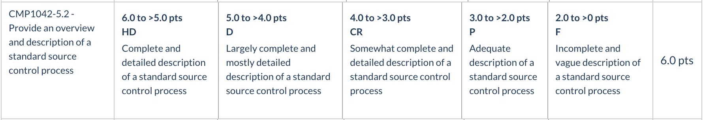

------

​																												

### Q5

------

Provide an **overview** and **description** of a standard software testing process (e.g. manual testing). ( Word Count: 100-200 )

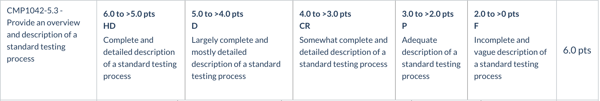

------

> Having suffered several cyber attacks in the past and resultant remedial audits *ACME* Corporation takes compliance, security and privacy very seriously. The following set of questions relate to this RfQ-requirement.

### Q6

------

**Discuss** and **analyse** requirements related to information system security and how they relate to the **project**. ( Word Count: 100-200 )

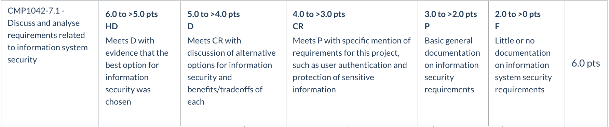

------

### Q7

------

**Discuss** common methods of protecting information and data and how you would apply them to the **project**. ( Word Count: 100-200 )

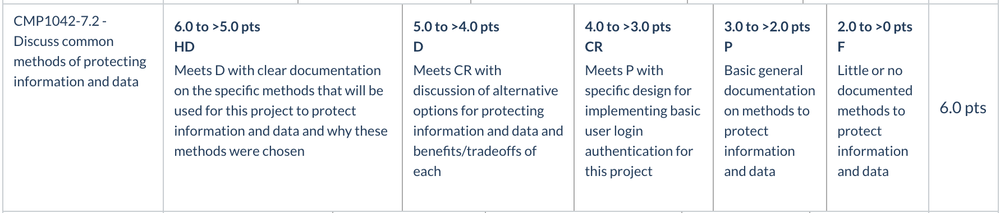

------

### Q8

------

**Research** what your legal obligations are in relation to handling user data and how they can be met for the **project** ( Word Count: 100-200 )

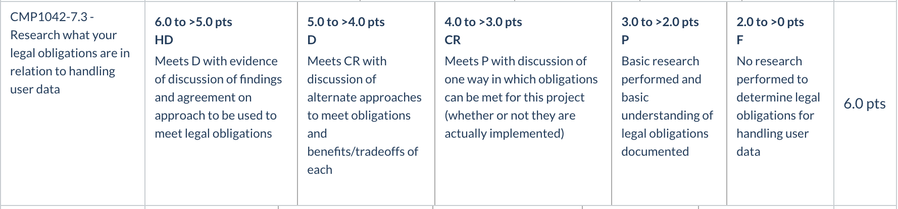

------

> *ACME* Corporation has specifically requested the *app* to be based on a *relational* database. The next set of questions relate to this RfQ-requirement.

### Q9

------

**Question**: **Describe the structural aspects of the relational database model. Your description should include information about the structure in which data is stored and how relations are represented in that structure. ( Word Count: 100-200 )**

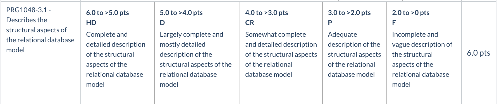

------

In relational databases data is structured in a **tabular** format.  All tables (or relation) names are **unique** and within any given table the ***column*** and ***row*** fields represent ***attributes*** and the ***records*** or entries ***respectively*** - it is in this way that relations are represented. 

*All* entries in an attribute column have the same *datatype*. This is specified when the table is generated. 

Image 1.0 below shows a section of the schema file from a recipe web app that details the "recipes" table/relations attribute columns and their respective datatypes. 

For every row there will be a *single entry* for each of these attribute column fields. For example, a single string entry for attribute column "title", a single string entry for "summary", a single text entry for "method" etc, and these entries make up that unique row/tuple, which will be identifyable by its unique *primary key*.

1.0

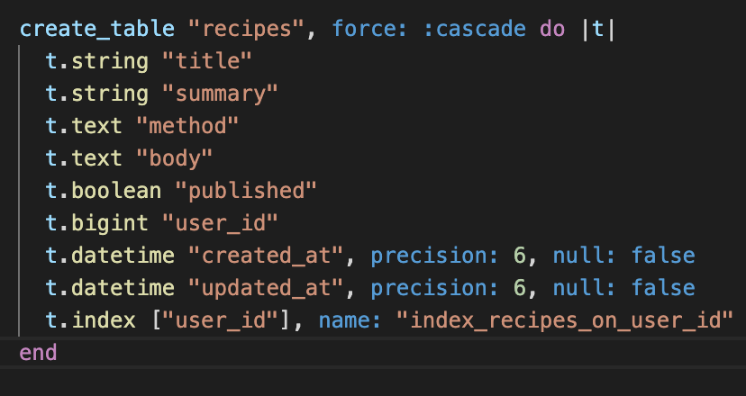

**Because each relation has a column attribute containing a unique primary key field other tables/relations can include this primary key ID as a foreign key, enabling the construction of a complex and accurate way to associate data.**

This unique primary key also prevents problems associated with duplicated entries, so although there may be many entries with the same title for a recipe (if we continue with the example at hand), the unique primary key establishes an identifier allowing interaction and identification with that correct and unique row. This also means that this primary key must have a *known* value, this means it can't be a "NULL" value.(1) 

1.2

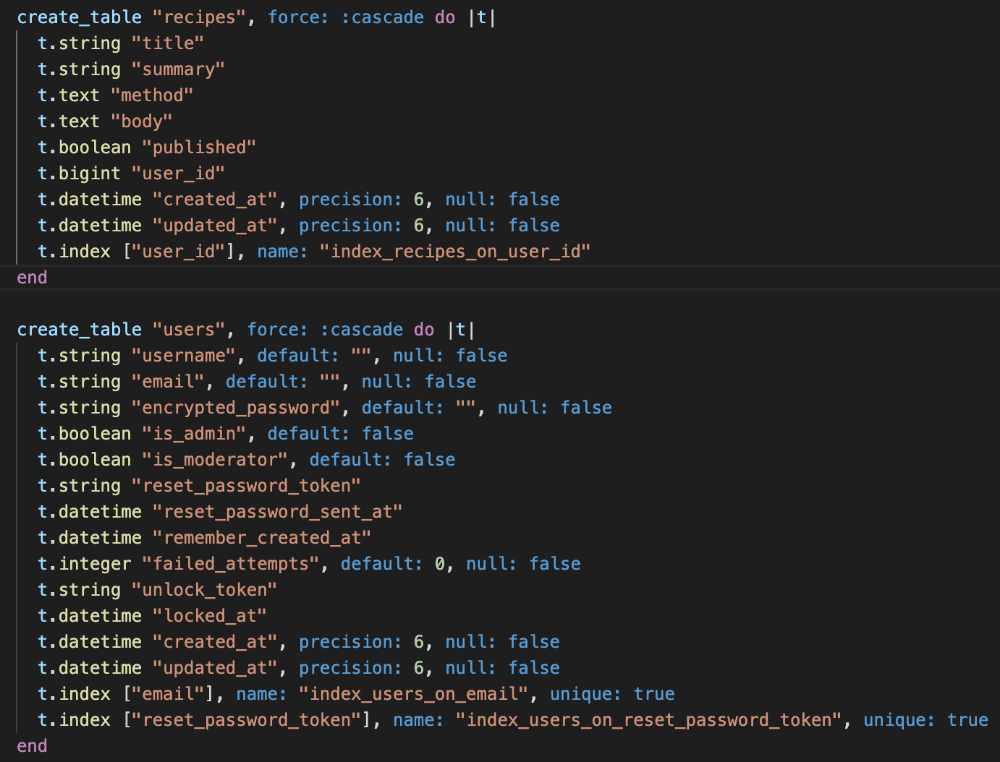

### Notes:**

1. Mike Chappelle 'Definition of Database Relation', in 'Lifewire', (last updated: 10/01/2020), acessed 1/5/20 at: https://www.lifewire.com/relation-definition-1019260

2. Georgia Leng, Nic Megoran and Joshua Gillmore, *Recipe App* 'Eats Good', (2020), schema.rb, lines 39-49, available at:  https://github.com/NicMeg/recipe-app 

### Q10

------

**Question**:  ( Word Count: 100-200 )

**Rubric**: **Describe** the integrity aspects of the relational database model. Your description should include information about the types of data integrity and how they can be enforced in a relational database.

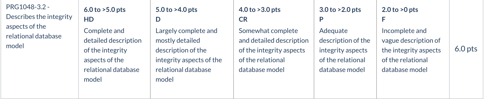

Data integrity encompasses a set of practical principles that ensure that all data within a database is able to be connected or traced in relation to other data. Planning and implementing well engineered data integrity principles are essential to establish a database that is able to perform well in the long run, in terms of maintenance, use and interaction and expansion. 

Three core constraints make-up data integrity management:

**Domain Integrity** Domain integrity simply refers to implementing constraints that enforce all entries in a particular column are single entries of an identical datatype. This datatype or domain has a set of valid possabilities. This constraint is enforced upon generating the relation and may be specified, and usualy is, as a standard datatype appropriate for the task, for instance the domain for user names could be a set of character strings. Alternatives to standard datatypes are available and necessary for certain attributes and can be implemented. Domain integrity may also (and frequently does) involve allowing set possibilities within a range, between certain intergers for example, or certain dates.(1) 

**Entity Integrity** - Can be established with Primary Key values in relations. As discussed in the previous section, this can not be a null value, as this would render some rows in the relation unidentifiable. The primary key attribute must be something every row or instance in the relation will have and every relation must have a primary key column if complying with primary key entity integrity principles. A common and clear example may be enrollment numbers, or a user ID - something that will be assigned on every instance and be a unique single entry in this primary key field; *this* way the presence of other null values for other attributes are less problematic and the row as a whole remains uniquely identifiable and tracable through its primary key. 

**Referential Integrity**  Referential Integrity requires any foreign keys in a relation have a valid corresponding unique primary key *or* a null value. When the database creator generates the relations the referential integrity constraints are specified by the creator. An example may be that a recipe table may have a foreign key of user ID from the user relation, this user ID must be the user relations valid primary key and must of course share the same datatype as the foreign key. This relationship would be described as parental, user relation is parent of recipe relation.  Adherance to referential integrity principles enforces the rule of relational databases whereby all data is traceable through relation(2). Referential integrity also relates to entity integrity in that it requires adherence to that prinicple in order to work as part of an integrated system.

A well structured approach to data-integrity that comprehensively encorporates all of these constraints sets a database in good stead moving forward.

**Notes:**

1) Adrienne Watt & Nelson Eng, *Database Design - 2nd Edition*, (2014), Victoria, B.C.:BCcampus, retrieved from https://opentextbc.ca/dbdesign01/ , Chapter 7 - The Relational Data Model..

2) Ian, *Database.Guide* (2017) Retrieved at  https://database.guide/codds-12-rules/ , on Cobb's rules.

3Adrienne Watt & Nelson Eng, *Database Design - 2nd Edition*, (2014), Victoria, B.C.:BCcampus, retrieved from https://opentextbc.ca/dbdesign01/ , Chapter 9 - Integrity Rules and Constraints.

4) Unlisted Author, Guru99, retrived from:  https://www.guru99.com/relational-data-model-dbms.html

### Q11

------

**Question**: **Describe** the manipulative aspects of the relational database model. Your description should include information about the ways in which data is manipulated (added, removed, changed, and retrieved) in a relational database. ( Word Count: 100-200 )

> The efficiency of an *app* (i.e. site) and the algorithms used are of the utmost importance. The next set of questions relate to this RfQ-requirement.

### 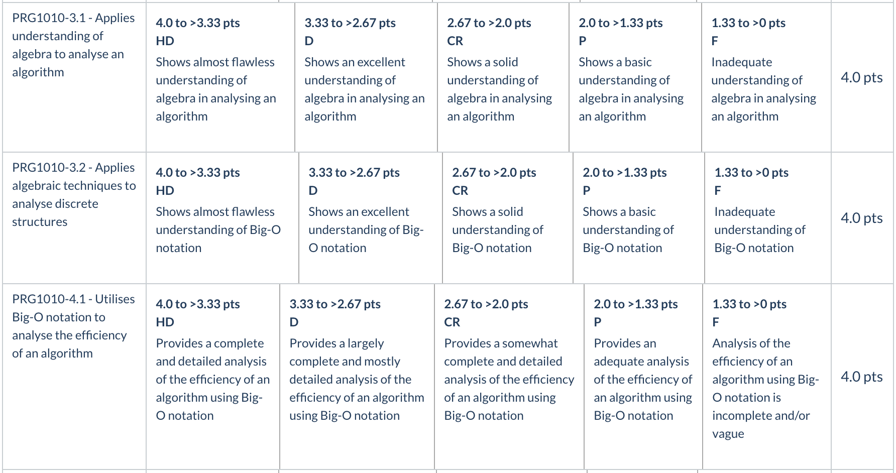Q12

------

**Question**: **Identify** and **explain** the workings of TWO **sorting** algorithms and **discuss** and **compare** their performance/efficiency (i.e. Big O) ( Word Count: 300-500 )

# Q13

**Question**: **Identify** and **explain** the workings of TWO **search** algorithms and **discuss** and **compare** their performance/efficiency (i.e. Big O) ( Word Count: 300-500 )

> Companies (including *ACME* Corporation) value previous project experience and case studies. The following set of questions relate to this RfQ-requirement.

## Q14

**Question**: ( 50-100 per part )

Conduct **research** into a marketplace website (*app*) and answer the following parts: 

### a. List and describe the software used by the \*app\*.

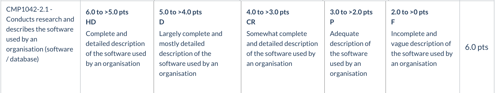

------

## b. Describe the hardware used to host the \*app\*. 

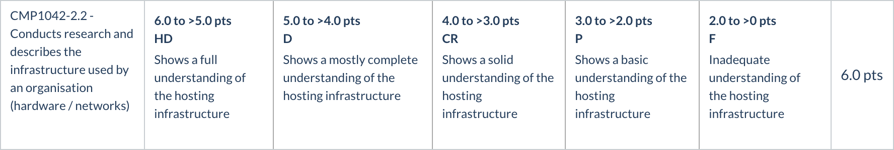

#### c. Describe the interaction of technologies within the \*app\*

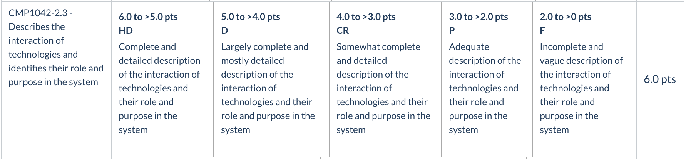

#### d. Describe the way data is structured within the \*app\*

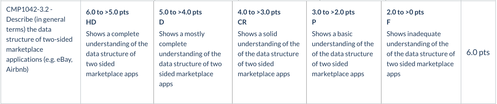

#### e. Identify entities which must be tracked by the \*app\*

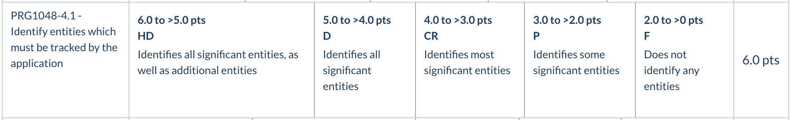

#### f. Identify the relationships and associations between the entities you have identified in part (e)

#### g. Design a schema using an Entity Relationship Diagram (ERD) appropriate for the database of this website (assuming a relational database model)

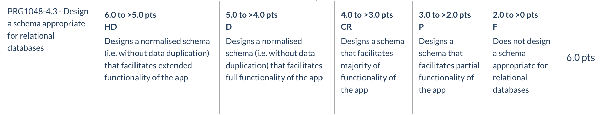
