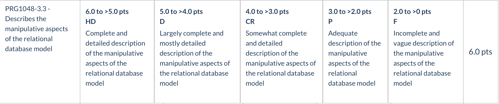
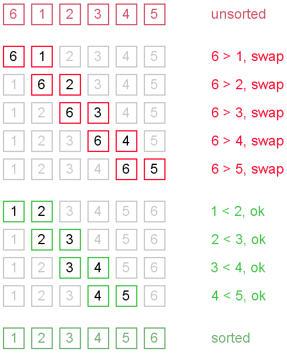

# T2A1 - Workbook - RfQ Response

## Name: Georgia Leng


> *ACME* Corporation is looking for *devs* with an understanding of *Rails*. The following set of questions relate to this RfQ-requirement. ( Word Count: 200-300 )

### Q1

------

**Question:** Describe the architecture of a typical *Rails* application ( 200-300 words )

****

At the core of a rails application's architecture is the MVC framework. 

In a ruby on rails app the **model** is a ruby class that represents objects of that particular class and provides a system for accomidating the logic and data. The model communicates with the database and can have relations and associations with other models. In a rails application we  declare associations in (for example) ourModels_model.rb file, this grants us access to methods and scopes that can be called on model objects and allow communication between other models/objects in order to create some real functionality in our apps. When we declare associations we are using a model's Active Record mechanisms which allows for objects to be represented in the database, manipulated and created in an object oriented manor, have associations and relations with other tables, represent class inheritance and heirarchies from other models and perform validations.(1)

The action **controller** is where we write all of our logic to handle requests from the user. It is **routed** a user request which will be associated to an action(method) corresponding to the request route. This action will execute kind of query or action relating to the model(s), it may be implicit or specified. For example maybe it will It will return the relevant information for available listings in a online store. In an instance like this we might see this 'new' action in a listings_controller.rb. New action accesses data from both the Listing model and the Category model (it is able to because of active record associations mentioned above) and is able to return these objects to the view associated with this action. In this instance it is a form which will take the params for a new instance of the Listing class. A seperate action will create the object by performing a Post request. The controller can perform different kinds of requests so long as the logic allows for it. It must 'speak' to the model because only the model accesses the database.

```
def new
    @listing = Listing.new
    @all_categories = Category.all.collect { |c| [c.book_category, c.id] }
  end
```

**Views** are what is rendered when a user request is routed to it.  A template or layout (or both) and receives any data from the associated controller which relays this from the model(s). The views are rendered in HTML, CSS and JSON, when we program our views, we write in embedded ruby. For our controller actions to perform they need to be associated with a view and routed correctly. Usually the Views directory has a directory within it associated with a controller with the same name. 


**Routes** direct incomming HTTP requests. Routes will be associated with a controller action which handles the request. Once complete it will be routed back to a view to present the completed request. Routes are declared in our config directory Routes.rb file.


Resources:

1. Rails Guides, 'Active Record Basics', acessed 6/5/20 at : https://guides.rubyonrails.org/active_record_basics.html#object-relational-mapping
2. Rails Guides, 'Action Controller Basics', acessed 6/5/20 at: https://guides.rubyonrails.org/action_controller_overview.html


### Q2

------

**Question:** **Identify** a database management system (DBMS) commonly used in web applications (including *Rails*) and discuss the pros and cons of this database. ( Word Count: 150-250 )


------

**PostgreSQL**

PostgreSQL is one of the oldest and widely used open source relational database management systems. Being open source and free is an obvious pro, but doesn't mean much as a stand alone. However the documentation for ProstgreSQL is extensive and so is its popularity and use, so there is plenty to be found in the way of official as well as community/user discussions and contributions. 

Other benefits include that PostgreSQL can be run on most operating systems, including Linux, Unix, Windows and Mac. Postres supports an extensive variety of datatypes but importantly also supports the creation of alternative datatypes for specialised instances and has infrastructure to make these indexable as well.(1)

PostgreSQL also llows for partitioning, which allows for minimising queries by breaking down entries in the database allowing sections to be 'ignored' which may have been iterated through otherwise.(2)

A drawback referenced on a number of forums is the absence of columnar tables. The problem this presents is this: a table may need to be parsed in its entirety, so this is a problem for viewing columns in larger tables. Suggestions are to, for example, have two 50 column tables rather than one 100 column table to ease the strain.(1)

Dataanalysts appear to bemoan that no machine learning included in PostgreSQL, meaning they often use external libraries of their choice. The extent of how limiting this particular drawback is remains unclear to me due to my limited exposure, but it does appear very minor, say, compared with the lack of columnar tables, it will not impact immediate performance in the same way. 

**resources:**

1. PostgreSQL documentation, acessed 22/5/30 at: https://www.postgresql.org/docs/ 
2. Sébastien Derivaux, "postgresql for data science", from 'Data to Results', acessed 22/5/20 at: https://dataintoresults.com/post/postgresql-for-data-science-pro-and-cons/


> ACME* Corporation is very big on project management, documentation and process. This will be a key metric in their decision to award the project. The following set of questions relate to this RfQ-requirement.

### Q3

------

**Discuss** the implementation of *Agile* project management methodology. ( Word Count: 200-300 )


------

Agile approaches aim to deliver products/updates fast and often. This helps keep products dynamic, adaptive and responsive to the concerns of users and the market. 

The agile methodology utilizes precise planning and breaking up of specific tasks and division of labor to break down larger projects into deliverable outcomes. This practice has become hegeomonic across programming workplaces and is usually coordinated and works closely with customer and outward facing sections of the team to determine things like appropriate timeframes etc. 

When I visited the MYOB office for my orientation in February I could tell they utilise this methodology. I could see large boards, with different sticky notes representing tasks within a **ticket**. There were also stand ups happening at any given time of the day where teams discussed challenges and ideas for moving forward. This is also where feedback and the team as a whole could reflect on the project with an eye to moving forward. 

A Sprint involves breaking down tasks into individual tickets with their own time frameworks, deadlines and priority levels. 

This style of organising is highly effective, not simply because 'breaking things down smaller' is useful, but because it is highly communicative and deeply social way of working through problems which makes for more efficient use of collective knowledge and approaches. I imagine that for this reason, the social element, many work places prefer to represent and track these tasks physically on a large board in a communal workspace , although of course online card systems are available and frequently used (For instance, a friend of mine once set up an essentially agile methodological approach which utilised Trello, to coordinate HOUSE HUNTING, delegate paper work, different tasks etc,  on one occasion).

What it might look like concretely:

1. **Road map and goal setting.**

   Assuming a strategy is pre-existing in the workplace, planning a road map which outlines timelines, goals, specfications such as features is the next step. This is done in consulation with stakeholders, users, sales, developers. This will outline and decide what the minimum viable product will be.

   2. **Sprint planning** and implementation

Moving away from big picture goals short term development 'sprints' are planned. These usually are a standardised time period, a few weeks and is the working rythm for the project. At the start of each sprint cycle there is planning with the involvmenet of the development team working on that sprint, then off to work. 

- daily stand ups to report progress or bugs throughout the sprint:
- What was completed yesterday?
- What is todays task?
- Roadblocks?

3. **Review**

   Everyone has been working together as a team so is familiar with challenges, successes, different things that worked - short review and take-aways for the next task.

   

**resources:**
1)The Ultimate Guide to Implementing Agile Project Management, acessed 23/5/20 at:  https://plan.io/blog/ultimate-guide-to-implementing-agile-project-management-and-scrum/

### Q4

------

Provide an **overview** and **description** of a standard source control workflow. ( Word Count: 100-200 )


------

Source Control is defined as an protocol to record the changes applied to a given developing piece of work for the entirety of the project. The purpose of the resulting chronology is to provide a map of changes that can be easily undone in erroneous circumstances. It also allows a user to manage possible conflicts and branching.

The most common <u>standard</u> variants of source control are the centralized and distributed version control models. In centralized version control a central server receives committed changes and allocates updates to local codebases. In the distributed method a user will commit and receive updates from a remote repository, this repository then reports to a central server which handles foreign push and pull requests.  

The addition layer or stage between the user in the distributed method is an indispensable safeguard for any project. Usually any new change or feature is developed in its own branch. This safeguard is even more critical and beneficial when handling very large teams where coordinated work on projects must be done safely. The host or owner(s) of a master branch are able to safely check for conflicts before merging any changes to a master branch. Git is a common **distributed** version control utilized for source control that many experienced as well as new programmers work with every day both for their own small projects and very large collaborative projects.

Resources:

1) Michael Ernst, 'Version Control Concepts and Best Practices', acessed 25/5/20 at: https://homes.cs.washington.edu/~mernst/advice/version-control.html																												


​																												

### Q5

------

Provide an **overview** and **description** of a standard software testing process (e.g. manual testing). ( Word Count: 100-200 )


------

Manual testing is an essential step in the development process. It intends to establish positive behavior outcomes of the code. A tester takes the role of an end user and submits the program to a series of tests. The tester-users may explore the interface or employ more elaborate testing methods to simulate the extent of user experience. A sufficient outcome is one which complies with projected user experience outcomes. 

1. Software testing process work-flow
   1. In this phase, analysis is conducted to deduce the complete performance expectations. 
   2. A software requirements specification document may be produced.
   3. The review considers the functional requirements and expectations.

2. Matrix environment to test functionality across multiple platforms and improve life-cycle prospects. 
   1. A test plan is produced to represent the differences across environments and to consider the product life-cycle.
3. Testing
   1. Test cases
   2. All navigation pathways are exhausted
   3. Bugs reported
   4. Functionality tested
   5. Performance, Load testing etc.
   6. Repression testing
4. SRS Review

**Resources:**

1)Waterfall Software Development Model, accessed 26/5/20, at: https://www.oxagile.com/article/the-waterfall-model/


> Having suffered several cyber attacks in the past and resultant remedial audits *ACME* Corporation takes compliance, security and privacy very seriously. The following set of questions relate to this RfQ-requirement.

### Q6

------

**Discuss** and **analyse** requirements related to information system security and how they relate to the **project**. ( Word Count: 100-200 )


------

If the app will accesses or collect individual's data it must have certain safeguards in place to ensure the integrity of this data. This is both a legal requirement as well as a functional requirement. 

Some requirements to insure information system security could include both preventative and responsive protocoles and practices.

**Acess controls**

- Authentication

- Authorization Management,and restricted/controlled user access 

- Specific User Access Roles - limiting access and functionality appropriately. 

-  Awareness, Training, and Education - Companies usually regularly hold refresher compliance training around security and cyber security legal and company obligations. Furthermore companies often encourage users to use good password practices and ensure that staff will never ask for their password or credit card details etc.

  **Data protection safeguards**

-  Electronic Data Disposal and Media Sanitization - ensuring personal data is not retained if it is no longer needed, that it is anonomysed or user input is sanitized to ensure data integrity.

-  Encryption - Information Security Risk Management - an essentail safeguard incase of breaches or unauthorised acess to sensitive / indetifiable personal data associated with individuals.

- Network Security - workplaces will have (or should!) a private network. The COVID19 crisis has seen remote working and increased need for cyber security awareness. All remote work is usually done connected to the company VPN to prevent interception of data (for instance if using public wifi, or wifi at home, if one person on the network does not use safe internet practices could mean other people on the network are at risk)

-  Physical Security - the behaviour of individuals in a workplace can make a big difference, acess and asking for what purpose data is for/checking permissions/ locking devices when leaving workstations are all critical practices that ensure previous preventative measures are not undermined by carelessness.

-  Secure Coding and Application Security - this as a starting point reduces risks of attacks

- Security Log Collection, Analysis, and Retention 

- Third Party Vendor Security and Compliance - Standards that are outlined by security bodies or governments or company policies that must be met can ensure software or practices are at industry standard before they are released or utilised. 

-  Security of Enterprise Application Integration 

- Vulnerability Management - risk acessment and understanding of what certaian degrees of risk mean concretely and what breaches could mean concretely for operations and the company more broadly, individuals, legal etc.

  **Detecting and responding protocoles**

  unlike the above these are responsive or reactive protocoles, but are equally critical. 

  -  Disaster Recovery Planning and Data Backup for Information Systems and Services - being able to respond and having contingency plans is equally as critical as preventative measures. These would usually be planned by security advisory boards or a head of security, depending on the size of the company.

    

  


### Q7

------

**Discuss** common methods of protecting information and data and how you would apply them to the **project**. ( Word Count: 100-200 )


------

Rails has a number of built in security helpers, but these are only powerful in so far as we fully understand how to use the framework appropriately. For instance rails is well protected against SQL injectino attacks, but there are still other vulnerabilities to be aware of and proactive to prevent.

**Session Hijacking** is a threat to safeguard against. Although the app will implement authentication and authorization as a  keysecurity measure to restrict and control access, these work by storing a session id. This session cookie can be vulnerable to identification. I would force a secure connection over SSL to safeguard against this. This line of code is reccomended for the application config file in the rails security docs.(1). Many third party SSL services are available to help secure web apps and that would be one way to insure a high standard of security integrity. 

```
config.force_ssl = true
```


Similarly, one line of code can prevent **Session Fixation** attacks:

```
reset_session
```

However, the Devise authentication gem resets sessions for us upon user sign in and out, and is one of the gems I would utilize to restrict user access and roles already. In this instance, it is worth highlighting that it is very important to have clear log out points on the website for this to be of benefit. 
Devise also provides password encryption and handles those things for us. This is ideal, as Devise has extensive documentation and is regularly kept in-check by the rails develpment community to ensure it is a trusted secure app. This is highly preferable to taking responsability for handling and keeping users passwords secure.

Devise also provides a single general error message if a user's password is wrong OR the user's log-in name is also not valid. This is a simple way to add an additional barrier against brute force attacks, as it helps to prevent a easy list of valid users, and then a subsequent brute force attack on their passwords.

Finally sanatizing all user input is critical. SQL injection attacks can be devistating, and so any user-input that is left unsanitized, or poorly coded search or forms can be potentially extremely destructive vulnerabilities. Sanatizing all user input is one way to safeguard against this. This can be as simple as seperating the input string from the conditional part of the query.

A developer team will have protocoles and checklists to make sure everything is up to scratch before moving on to testing. 


Resources:

1)  *Rails Guides*, Security retrived 26/5/20 at: https://guides.rubyonrails.org/security.html

2)https://github.com/ankane/secure_rails https://hakiri.io/ https://rubygarage.org/blog/ruby-on-rails-web-application-vulnerabilities-how-to-make-your-app-secure


### Q8

------

**Research** what your legal obligations are in relation to handling user data and how they can be met for the **project** ( Word Count: 100-200 )


The Privacy Act dictates the extent to which large businesses and government organizations may  use, disclose and collect "reasonably identifiable" personal information. Entities and organisations are limited in their legal capacity to collect personal information unless it is demonstrable that this information is vital to the functions of that organisation or entity, they are also prohibited from collecting sensitive information such as those relating to sexuality or personal belief when individual consent is not given (APP 3). As such, any personal data which is not constituted as necessary to the functioning of my workplace and in particular sensitive information is potentially unlawful.

The collection of personal information must be done on an individual by individual basis (APP3.6) unless some territorial law dictates otherwise. And the storage of personally identifiable data must be stored securely.

In my project I have a legal responsibility to;

1. Not request data that is considered private, that is; concerning sexuality, disability or religious denomination (ICGL 4). I must only request this data in the instance where this information is imperative to the operation of the project, ie sexual orientation for a dating app or disability for a health related project. 
2. I must be completely transparent in my usage of personal consumer data (APP 1)
   1. That is; make users aware of how data will be used.
3. I must not disclose personal information to third parties (APP 3)
   1. If data is transferred to a third party I must ensure that the recipient complies with Australia privacy law
4. I must not hold data without the consent of the user (APP 11)
5. Held data must be accurate and up-to-date
6. I must take reasonable steps to ensure the security of personal information

There is no clear indication nor legal precedent to assume that information such as metadata, anonymized data etcetera is to be considered personal under the legal definition, as such I have no legal responsibility to the user in cases where data cannot be immediately identifiable with the user. This implies that in the handling of arrays of data it may be best practice to anonymize data and or encrypt data to maintain legal headway. 

As such it is pertinent for the project to establish clear indications to users that all essential data will be encrypted or anonymized. As to how this would be implemented would depend entirely on my own team and ACME's protocols as outlined by the respective Security Steering Committees or equivalent bodies. 

If I were to develop an airBnB style application, in accordance with the law I would have to implement a system of encryption for private and personal data as this information would be *necessary* for connecting hosts with users and so vital for functionality, but subject to specific laws as it is considered sensitive personal data. Additionally, I would opt for a decentralized model where users carry their own data on their devices and where anonymized identifiers would remotely represent these values in data channels or in storage.

**Resources:**

1) MYOB privacy policy https://www.myob.com/au/privacy-policy

2) Amazon privacy and security compliance (https://aws.amazon.com/security/)

3)Dennis Miralis, Phillip Gibson, '*Australia: Data Protection 2019'*(2019), Relevent Legislation and Competent Authorities. acessed at: https://iclg.com/practice-areas/data-protection-laws-and-regulations/australia

4) Australia Privacy Act 1988


> *ACME* Corporation has specifically requested the *app* to be based on a *relational* database. The next set of questions relate to this RfQ-requirement.

### Q9

------

**Question**: **Describe the structural aspects of the relational database model. Your description should include information about the structure in which data is stored and how relations are represented in that structure. ( Word Count: 100-200 )**


------


In relational databases data is structured in a **tabular** format.  All tables (or relation) names are **unique** and within any given table the ***column*** and ***row*** fields represent ***attributes*** and the ***records*** or entries ***respectively*** - it is in this way that relations are represented. 

*All* entries in an attribute column have the same *datatype*. This is specified when the table is generated. 

Image 1.0 below shows a section of the schema file from a recipe web app that details the "recipes" table/relations attribute columns and their respective datatypes. 

For every row there will be a *single entry* for each of these attribute column fields. For example, a single string entry for attribute column "title", a single string entry for "summary", a single text entry for "method" etc, and these entries make up that unique row/tuple, which will be identifyable by its unique *primary key*.

1.0


**Because each relation has a column attribute containing a unique primary key field other tables/relations can include this primary key ID as a foreign key, enabling the construction of a complex and accurate way to associate data.**

This unique primary key also prevents problems associated with duplicated entries, so although there may be many entries with the same title for a recipe (if we continue with the example at hand), the unique primary key establishes an identifier allowing interaction and identification with that correct and unique row. This also means that this primary key must have a *known* value, this means it can't be a "NULL" value.(1) 


1.2


### Notes:**

1. Mike Chappelle 'Definition of Database Relation', in 'Lifewire', (last updated: 10/01/2020), acessed 1/5/20 at: https://www.lifewire.com/relation-definition-1019260

2. Georgia Leng, Nic Megoran and Joshua Gillmore, *Recipe App* 'Eats Good', (2020), schema.rb, lines 39-49, available at:  https://github.com/NicMeg/recipe-app 

### Q10

------

**Question**:  ( Word Count: 100-200 )

**Rubric: Describe the integrity aspects of the relational database model. Your description should include information about the types of data integrity and how they can be enforced in a relational database.****


Data integrity encompasses a set of practical principles that ensure that all data within a database is able to be connected or traced in relation to other data. Planning and implementing well engineered data integrity principles are essential to establish a database that is able to perform well in the long run, in terms of maintenance, use and interaction and expansion. 

Three core constraints make-up data integrity management:

**Domain Integrity** Domain integrity simply refers to implementing constraints that enforce all entries in a particular column are single entries of an identical datatype. This datatype or domain has a set of valid possabilities. This constraint is enforced upon generating the relation and may be specified, and usualy is, as a standard datatype appropriate for the task, for instance the domain for user names could be a set of character strings. Alternatives to standard datatypes are available and necessary for certain attributes and can be implemented. Domain integrity may also (and frequently does) involve allowing set possibilities within a range, between certain intergers for example, or certain dates.(1) 

**Entity Integrity** - Can be established with Primary Key values in relations. As discussed in the previous section, this can not be a null value, as this would render some rows in the relation unidentifiable. The primary key attribute must be something every row or instance in the relation will have and every relation must have a primary key column if complying with primary key entity integrity principles. A common and clear example may be enrollment numbers, or a user ID - something that will be assigned on every instance and be a unique single entry in this primary key field; *this* way the presence of other null values for other attributes are less problematic and the row as a whole remains uniquely identifiable and tracable through its primary key. 

**Referential Integrity**  Referential Integrity requires any foreign keys in a relation have a valid corresponding unique primary key *or* a null value. When the database creator generates the relations the referential integrity constraints are specified by the creator. An example may be that a recipe table may have a foreign key of user ID from the user relation, this user ID must be the user relations valid primary key and must of course share the same datatype as the foreign key. This relationship would be described as parental, user relation is parent of recipe relation.  Adherance to referential integrity principles enforces the rule of relational databases whereby all data is traceable through relation(2). Referential integrity also relates to entity integrity in that it requires adherence to that prinicple in order to work as part of an integrated system.

A well structured approach to data-integrity that comprehensively encorporates all of these constraints sets a database in good stead moving forward.


**Notes:**

1) Adrienne Watt & Nelson Eng, *Database Design - 2nd Edition*, (2014), Victoria, B.C.:BCcampus, retrieved from https://opentextbc.ca/dbdesign01/ , Chapter 7 - The Relational Data Model..

2) Ian, *Database.Guide* (2017) Retrieved at  https://database.guide/codds-12-rules/ , on Cobb's rules.

3) Adrienne Watt & Nelson Eng, *Database Design - 2nd Edition*, (2014), Victoria, B.C.:BCcampus, retrieved from https://opentextbc.ca/dbdesign01/ , Chapter 9 - Integrity Rules and Constraints.

4) Unlisted Author, Guru99, retrived from:  https://www.guru99.com/relational-data-model-dbms.html


### Q11

------

**Question**: **Describe** the manipulative aspects of the relational database model. Your description should include information about the ways in which data is manipulated (added, removed, changed, and retrieved) in a relational database. ( Word Count: 100-200 )



In relational databases SQL database language allows us to manipulate our data. We can use SQL to generate the database and it's table structures, add, update and remove from the database and also access our database through queries in order to retrieve data and present it in a usable format. (1)

SQL command statements are how we perform these manipulations. Below is a server log showing the SQL commands being carried out when a user utilises a search function on a recipe web app for "chicken". In this Ruby on Rails app example, the logic for this function was not written in pure SQL, but Active Record converts the logic to an equivalent SQL query and performs it, as seen below in the server log.(2)

While the search function example shows how SQL manipulates and interacts with data, in this instance it is not changing the data, it is retrieving it for use. Other command statements that do allow manipulations that change data are as below:

SELECT - to query data in the database

INSERT - to insert data into a table

UPDATE - to update data in a table

DELETE - to delete data from a table (3)

Img 1.3 (4)


**Notes:**

1)  Adrienne Watt & Nelson Eng, *Database Design - 2nd Edition*, (2014), Victoria, B.C.:BCcampus, Chapter 15 SQL Structured Query Language,  https://opentextbc.ca/dbdesign01/chapter/sql-structured-query-language/

2)  *Rails Guides*, Active Record Query Interface retrived at: https://guides.rubyonrails.org/active_record_querying.html

3) Adrienne Watt & Nelson Eng, *Database Design - 2nd Edition*, (2014), Victoria, B.C.:BCcampus, Chapter 16 SQL Data Manipulation Language, https://opentextbc.ca/dbdesign01/chapter/chapter-sql-dml/

4) Georgia Leng, Nic Megoran and Joshua Gillmore, *Recipe App* 'Eats Good', (2020), available at:  https://github.com/NicMeg/recipe-app , live web app : https://eats-good.herokuapp.com/ , screen shot of local server log showing server action upon forming search request and search results on app open in browser.


### 

The efficiency of an *app* (i.e. site) and the algorithms used are of the utmost importance. The next set of questions relate to this RfQ-requirement.

### Q12

------

**Question**: **Identify** and **explain** the workings of TWO **sorting** algorithms and **discuss** and **compare** their performance/efficiency (i.e. Big O) ( Word Count: 300-500 )

Insertion Sort is a relatively simple sorting algorithm method which takes items from an array and one by one re-inserts them into an array in order. Because insertion requires shifting ever element in one-by-one it can be particularly expensive. Shellsort is an Insertion Sort variant which was developed to be more resource efficient (1).  The main innovation over its contemporary is that it is capable of moving out of order elements multiple positions at a time. It has an O(n) best-case and O(n^2) average, its worst-case space complexity is O(n).

Bubble Sort is another kind of simple sorting algorithm. It moves through a dataset pair by pair, reordering neighboring elements. Once it has moved through the set of numbers, it begins again until no reordering is necessary.  It is useful for sorting smaller datasets or even large data sets that are almost complete fairly efficiently.  It has an O(n log n) best-case and a highly variable average performance, its worst-case space complexity is O(n).

Both Bubble Sort and Shellsort are simple sorting algorithms which operate in worst-case at O(n^2). They are fairly efficient when handling sets of numbers which are almost in order. On the opposite side of the spectrum, quicksort has demonstrated an profound ability to sort large arrays through implementing a 'pivot' element which represents the modal value which breaks the set into two arrays, one representing values less than the middlemost value and the other representing values greater than the mode. It then implements recursive sorting. Although Quicksort is not memory intensive, it has the potential to degenerate to O(n^2) when recursion depth is out of hand. Otherwise, Quicksort is best-case O(n log n) or O(n), its average is O(n log n)

Quicksort example


bubble sort eg:



|              | Bubblesort   | Quicksort                   |
| ------------ | ------------ | --------------------------- |
| Worst-case   | O(n^2)       | O(n^2)                      |
| Average-case | O(n^2)       | O(n log n)                  |
| Best-case    | O(n) or O(1) | O(n log n) (*) or O(n) (**) |
| Complexity   | O(n)         | O(n) or O(log n)            |

*simple partition

**three-way partition

------

From the above table it appears that Bubble sort and Quicksort have the same worst-case, Quicksort is the clear winner when comparing average and best cases. But where Bubble sort is beneficial is in its ability to detect the efficiency of the sorted list. Even though, in the best case where the list is already sorted it, Bubble sort has a complexity is only O(n) but Bubble sort does not have to perform a whole rotation before it begins sorting like other algorithms. As such, Bubble sort has advantages in situations where the list is already well sorted.

1. http://penguin.ewu.edu/cscd300/Topic/AdvSorting/p30-shell.pdf


# Q13

**Question**: **Identify** and **explain** the workings of TWO **search** algorithms and **discuss** and **compare** their performance/efficiency (i.e. Big O) ( Word Count: 300-500 )

Linear search moves through a data set incrementally until it finds the specified element or exhausts its medium and hence, it has a linear runtime complexity of O(n). It is practical for a small number of elements.

Find 11

T(n) = T()

O(n)

{1,3,5,7,9,11}

11 > 1,3,5,7,9

11 = 11

.: n=6

Binary search has a complexity of O(log n). It divides the dataset at each iteration and thus saves time, the draw back is that this search method requires presorting of data. Without the presorting it may be partial to recursion.

T(n) = T(n/2) + c

​		= (T(n/4) + c )) + c

​		= (T(n/8) + 3c

...

T(n) = (n/2^k) + kc

n = 2^k, T (n/2^k) = T(2^k/2^k) = T(1)

log2n=k

T(n) = T(1) + log2nc

​		= c+log(base2)nc

​		= c(1+logn)

​		= O(1+logn)

​		= O(logn)

{1,3,5,7,9,11}

k = log(base 2)n

.: n = 1*2^k

{8,9,11}

11>9

{11}

11=11

.: n = 3

|            | Linear Search | Binary Search |
| ---------- | ------------- | ------------- |
| Worst-case | O(n)          | O(log n)      |
| Best-case  | O(1)          | O(1)          |
| Average    | O(n)          | O(log n)      |
| Compexity  | O(1)          | O(1)          |

Although the linear search produced a lower value for n, I can't reliably confirm that this method is faster because we are comparing one instance where n is always equal to the number of items in the array against a log base2 equation.

Linear search is only useful in situation where iterating through the entire list is likely to be necessary although it can have negative drawbacks when item probabilities vary widely.

**resources:**
http://www.cas.mcmaster.ca/~alhassm/3ea3_2017/benjaminmiller.pdf

> Companies (including *ACME* Corporation) value previous project experience and case studies. The following set of questions relate to this RfQ-requirement.

## Q14

**Question**: ( 50-100 per part )

Conduct **research** into a marketplace website (*app*) and answer the following parts: 


### a. List and describe the software used by the \*app\*.


  **Programming languages** - Ruby and Javascript.

*Ruby* is a dynamically typed object oriented programming language. It is an interpreted high-level programming language with broad applications for general programming making it very popular. 
*Javascript* is a language that fits the ECMAScript specifications. Javascript is a high-level compiled dyamically typed language and It is prototype-based object-oriented. 

  **And frameworks?** 

for **Ruby** :**Ruby on Rails**. The Ruby on Rails framework is open source and has been utilized to build lots of big name apps since its release in 2004. Rails' 'convention over configuration' doctrine helps developers  focus on how the high level functionality of their apps will be structured, rather than configuration details (Eg how model relates to other tables, indexing primary keys). Because rails has rules, or conventions for how Models are named and how relations are establisehd between them, for instance, less time is spent configuring details like this, just follow the rules and get into the *real* details and challenges of the project. This means complex dynamic apps that meet MVC software design protocol can be built very rapidly and makes it an attractive framework. 

for **Javascript: React**

React is a framework designed to make interactive user interfaces.It renders approrpiate views for each state of the application. What react renders reflects data changes to provide the appropriate view. These views are managed in components, meaning it can handle rich data. React can utilize plugins and is flexible and works across different tech stacks.

**Payments**

**Web server** - Nginx. HTTP and proxy server. 

**Cloud storage -** Amazon S3, EBS. Secure storage of user images. Users upload photos of their properties for listings.

**Cloud database** - Amazon RDS. Amazon's RDS is a cloud relational database. 

**Software relating to data:** 
**Presto** is open source SQL query engine specialised for large amounts of data.

**Druid** is data mangement software written in Java. It is column oriented, which is esseential for handling big data. It provides Airbnb with lowlatency queries and would be essential for analytics.

 **Airpal**  -This is a user interfaces for utilising Facebook's Presto:DB  (as discussed above). Airpal simplifies making queries by providing a visual interactive interface minimising hassle of manual written queries. 

This is certainly not an exhaustive list, but the best that can be managed in the word limit that still *describes* the software to a degree.

Resources:
1) https://www.forbes.com/sites/quora/2018/02/20/what-technology-stack-does-airbnb-use/#7f7ae88b4025

2) https://www.ruby-lang.org/en/

3)https://rubyonrails.org/doctrine/

4) https://en.wikipedia.org/wiki/JavaScript

5) https://reactjs.org/

6) https://redislabs.com/redis-enterprise-deployment/infrastructure/

7) https://aws.amazon.com/security/

8)https://docs.aws.amazon.com/AWSEC2/latest/UserGuide/concepts.html

9) https://prestodb.io/

10)
11)https://airbnb.io/airpal/


## b. Describe the hardware used to host the \*app\*. 


**Web App Hosting:**

**Amazon EC2**. Amazon EC2 can provide virtual computing environments (instances) high amounts of traffic in a reliable way. It makes sense to use a trusted third party for remote servers and storage rather than investing in huge amounts of hardware that would need to be appropriately cooled etc. Air BnB uses Amazon Ec2 because they need:

- multiple web servers 
-  load balancing, autoscaling, or external databases
- Ongoing high CPU utilization
- high level of specific web server configuration and administrative support


**Data storage:**

**Key-value storage** -Amazon Redis cache infrastructure for hosting large size datasets. 

**Cloud storage -** **Amazon S3, Amazon Elastic Block Store.** Large amounts of user data, such as images would be hosted here. Amazons EBS infrastructure can support single-digit-milisecond latency for high performance database workloads such as SAP HANA or gigabyte per second throughput for large, sequential workloads such as Hadoop.

**Resources:**
1) https://redislabs.com/redis-enterprise-deployment/infrastructure/


#### c. Describe the interaction of technologies within the \*app\*


Users will interact with a web-app via browser. The app is hosted on AWS web servers. The user's browser sends http requests to the server and the server returns the appropriate response in view form to the user. In the instance of Airbnb, users can log in as guest mode or host mode, the React framework will handle the different views for each mode. Before this happens the controller will handle the specific request and access data from the model needed to display in the appropriate view associated with the invoked controller action. Then the data and view is compiled and rendered.


#### d. Describe the way data is structured within the \*app\*


The data is structured in a relational database. Air bnb's respective tables will be organised in a tabular manner with column attributes and rows representing each instance/object of that table. Tables will have foreign key relations that point to other objects in other tables that create structural relationships. Associations can also be declared in the models which allow for join tables. Relations and associations between tables allow for the functionality and complex object relationships required in a two way marketplace app.

#### e. Identify entities which must be tracked by the \*app\*


**Table users** U {
  id int [pk, increment] // auto-increment
  full_name varchar
  host boolean
  super_host boolean
  created_at timestamp
  country_code int
}
**Table profile** {
  id int [pk, increment] // auto-increment
  name varchar
  user_id foreign
 created_at timestamp
}

**Table payment** {
  id int [pk, increment] // auto-increment
  encrypted_credit_card varchar
  encrypted_name_on_card varchar
  encrypted_expiry varchar
  user_id foreign key
  description string
  created_at timestamp
}

**Table country** {
  code int [pk]
  name varchar
  continent_name varchar
 }
 **Table state** {
  code int [pk]
  name varchar
  country_id foreign key
 }

 **Table booking** {
 booking_id int
  user_id int
  name varchar
  price integer
  listing_id foreign
  status booking_status
}

**Table listing** {
  id int [pk, increment] // auto-increment
  user_id int [not null, unique]
  status varchar
  country_id foreign
  price integer
  state_id foreign


  created_at varchar [note: 'When order created'] // add column note


Ref: "users"."id" < "listing"."user_id"

Ref: "users"."id" - "booking"."user_id"

Ref: "listing"."id" - "booking"."listing_id"

Ref: "country"."code" - "listing"."country_id"


Ref: "users"."id" - "profile"."user_id"

Ref: "users"."id" - "payment"."user_id"

Ref: "users"."country_code" - "country"."code"

Ref: "state"."code" - "listing"."state_id"

Ref: "state"."country_id" - "country"."code"


#### f. Identify the relationships and associations between the entities you have identified in part (e)


Below are associations, relationships such as foreign keys are included previous answer.

**User**s 
Has_many :listings

has_many :bookings

**Listings.** 

Belongs_to :user, dependent: :destroy

Has_many :bookings through :users

Has_many_attached :picture

belongs_to :state

Belongs_to :country


**Bookings**

belongs_to :listing

belongs_to :user


**Country**

Has_many :listings

**City**

has_many :listings

**State**

Has_many :listings


#### g. Design a schema using an Entity Relationship Diagram (ERD) appropriate for the database of this website (assuming a relational database model)


